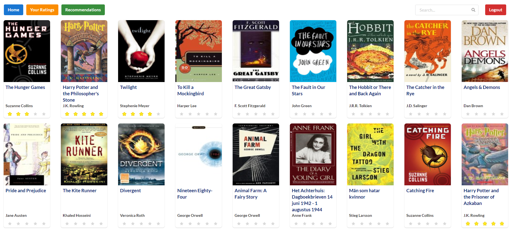

Book Recommender using matrix factorization
#### Specifications
* Add/Delete/Edit Rating
* Maintain and apply unique user profile to book recommendation algorithm

* React
* Flask

#### Backend

1. cd ./backend

2. python main.py

This will start a backend server at localhost:5000

#### FrontEnd

1. cd ./frontend

2. npm install (install dependencies)

3. npm start

Go to localhost:3000
